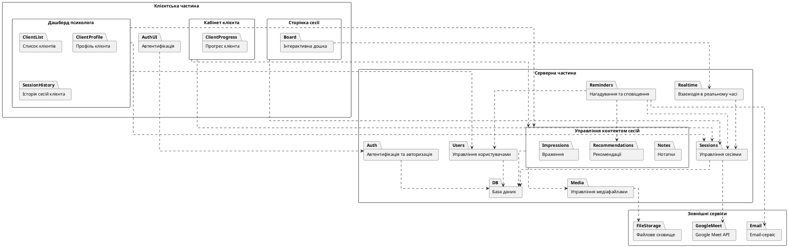

# Action Plan — Кваліфікаційна робота

Gaps identified by comparing `paper.md` against `requirements.md`.
All section numbers below refer to the **requirements document's** expected structure.

---

## Status Legend
- `[ ]` — not started / placeholder
- `[~]` — partially written, needs completion
- `[x]` — done

---

## Pre-writing (do before touching any section)

- [ ] **Global terminology replacement: "сесія" → "прийом"**
  - Currently: `paper.md` uses "сесія" / "сеанс" for the product concept of a scheduled
    appointment. The codebase uses "appointment" everywhere (Decision 3) to avoid collision
    with the `better-auth` `session` object.
  - Action: Replace all occurrences of "сесія" / "сеанс" used as the product concept with
    **"прийом"** (lit. appointment / consultation). Alternative: "зустріч" — pick one and
    apply globally across ВСТУП, РОЗДІЛ 1, РОЗДІЛ 2, РОЗДІЛ 3, ВИСНОВКИ.
  - Do NOT replace "сесія" when it refers to auth/HTTP sessions (e.g. "сесія користувача").

---

## РОЗДІЛ 1

- [~] **1.4 — Add subsection "Аналіз підґрунтя для розробки"**
  - Currently: paper goes 1.3 → 1.4 (Постановка задачі), skipping this section entirely
  - What to write: 1 paragraph synthesizing what was learned from sections 1.1–1.3 and
    what it implies for the design choices. Justify the web-app form factor and the
    decision to build a custom tool rather than extending an existing one.
  - Rename current 1.4 → 1.5 to match required numbering
  - **Also fix registration model in the resulting 1.5 (Постановка задачі)**: current text
    implies the psychologist registers clients. Update to describe the actual flow:
    both roles self-register via Google OAuth; a client gains access only after the
    psychologist adds them by email (registered users only — immediate link, no email).
    Remove any language implying the psychologist creates accounts for clients.

---

## РОЗДІЛ 2

- [ ] **2.3 — Requirements analysis using UML diagrams (INVEST)**
  - Currently: use-case diagrams are in appendices A, B, D — but no analysis is written
    in the body that ties them to INVEST properties
  - What to write: for each non-obvious diagram (sequences, activity), add a sentence
    stating (1) which requirement property is being analyzed, (2) what the analysis
    revealed, (3) what decision was made as a result
  - The activity diagram for Session Service (rис. 2.2) and sequence diagram (Appendix E)
    can be repurposed here — just add the INVEST framing around them in the text
  - **Whiteboard INVEST note**: the whiteboard FR bundles drawing + cursor sharing + image
    upload into one requirement, violating INVEST's "Small" criterion. Add a sentence in
    the analysis justifying the bundling: all three capabilities share the same WebSocket
    event stream and cannot be delivered or tested independently.

- [ ] **2.4 — Functional requirements table (in body, not only appendix)**
  - Currently: product backlog is in Appendix C only
  - What to write: a formal table in the body with columns:
    `№ | Назва вимоги | Важливість | Як продемонструвати | Примітки`
  - Rank requirements by descending importance (critical → high → medium → low)
  - After the table, add the non-functional requirements list (already written in 2.2 —
    move or reference them here)
  - **Stay within 25-FR ceiling**: 27 required tickets map to ~25+ FRs — apply these
    merges to reach ~23 FRs in the table:
    - EDG-18 + "Email: appointment rescheduled" → one FR: "Psychologist can reschedule
      appointments; client is notified by email"
    - EDG-19 + "Email: appointment deleted" → one FR: "Psychologist can delete upcoming
      appointments; client is notified by email"
    - NEW "Psycho can add client" + NEW "Added client receives access" → one FR:
      "Psychologist can add registered clients to their workspace"
  - **Add 3 missing NFRs** to the NFR list (currently 6, need to add these):
    - Data isolation (security): each psychologist-client pair's data is isolated;
      no cross-pair access. (Decision 6)
    - Notes privacy (privacy): psychologist notes are visible only to the authoring
      psychologist, even after the client-psychologist relationship ends. (Decision 16)
    - Single active appointment constraint (integrity): the system must enforce that no
      more than one appointment per psychologist can be in "active" state simultaneously.
      (Decision 5)

- [ ] **2.5 — Preliminary architecture: UML PACKAGE diagram**
  - Currently: paper has a component diagram (Appendix G) and labels it "preliminary"
    architecture — this is wrong. A package diagram ≠ component diagram.
  - What to write: a **UML package diagram** showing high-level functional groupings
    with dependencies between packages. See the diagram spec below.
  - The component diagram in Appendix G can be repurposed as the **refined** architecture
    (section 2.7) with minimal changes — just add explanatory text about what changed
    from preliminary to refined.
  - After the diagram: describe what business processes each package covers, analyze
    that all functional requirements are covered by at least one package.

- [ ] **2.4.x — Appointment lifecycle: UML state diagram** *(new deliverable)*
  - Currently: missing entirely
  - What to write: a UML state diagram for the appointment entity showing:
    - States: `upcoming`, `active`, `past`
    - Transitions: `Start` (psychologist action, guard: no other active appointment),
      `End` (psychologist action)
    - Guard on Start: if another appointment is active → show warning (Decision 22)
    - Terminal state: `past` is permanent; appointment cannot be deleted from past state
    - Note: no auto-transitions; all state changes are manual (Decision 25, 35)
  - Place in section 2.6 under the appointment management package subsection

- [ ] **2.4.1 — Interactive Board: detailed design content**
  - Currently: heading exists, zero content
  - What to write: an activity or state diagram showing the real-time board interaction
    flow (user draws → event sent via WebSocket → server broadcasts → other client
    renders). Analyze: what happens on reconnect? what is the state recovery model?
    Note the decision to use server-mediated state (not peer-to-peer) and its rationale.

- [ ] **2.4.x — Conceptual (infological / ER) DB model**
  - Currently: placeholder "Іапівапвап"
  - What to write: an ER diagram with entities and their attributes (no FK lines yet,
    focus on what data each entity holds). Key entities based on the system:
    `User`, `Psychologist`, `Client`, `Session`, `Note`, `Recommendation`,
    `Impression`, `SessionAttachment`, `MediaFile`
  - Description text: focus on what each entity represents, not how they link

- [ ] **2.4.x — Logical (datalogical) DB model**
  - Currently: placeholder "аівораіва"
  - What to write: a relational diagram showing tables with PKs, FKs, and cardinalities
    (1:N, M:N). This is the same diagram but with relationships drawn and types annotated.
  - Description text: focus on the relationships and what they represent

- [ ] **2.X → rename to 2.7 — Refined architecture: UML component diagram**
  - Currently: placeholder "Віваіва"
  - What to write: take the existing component diagram from Appendix G, reference it
    here as the refined architecture, and write 1–2 paragraphs explaining:
    (1) how the refined architecture differs from the package diagram (more detail,
    platform-specific components added, SessionAttachmentService consolidated),
    (2) why those changes occurred (insight from detailed design in 2.4.x).

- [ ] **Висновки до другого розділу**
  - Currently: placeholder "аіваіваіва"
  - What to write: 1–2 paragraphs summarizing what was done in section 2:
    business processes modeled, requirements formed (N functional, M non-functional),
    preliminary architecture with X packages designed, detailed design of key components,
    DB models built, architecture refined.

---

## РОЗДІЛ 3 — Almost entirely missing

- [ ] **3.1 — Technology and language justification**
  - Currently: placeholders throughout
  - What to write (~1–1.5 pages):
    - **Language**: TypeScript — type safety, ecosystem, same language front and back
    - **Backend runtime**: Bun — performance, native PostgreSQL SQL client, built-in test runner
    - **Backend framework**: Hono — lightweight, typed, Bun-native
    - **Frontend framework**: React Router v7 (framework mode) — SSR-capable, file-based routing
    - **UI library**: shadcn/ui — accessible, composable, TailwindCSS v4 based
    - **Database**: PostgreSQL — relational, ACID, suits the session/attachment data model
    - **Auth**: better-auth with Google OAuth — avoids building auth from scratch
    - **Real-time**: WebSockets (state the library/mechanism used)
    - **IDE**: VS Code or whichever you use
  - **Justify Google Calendar OAuth scope**: Decision 13 requests `calendar.events` scope
    from all psychologist accounts at sign-up, even though Meet link generation is optional.
    Add: "The scope is requested upfront to avoid interrupting the appointment-creation
    workflow with an additional OAuth redirect when the psychologist first opts in to
    Meet link generation."

- [ ] **3.2 — Structural scheme of the software (PSM)**
  - Currently: placeholder
  - What to write: a structural diagram showing the actual file/module structure of the
    implementation, matching the refined architecture from 2.7 but now naming actual
    files, folders, and frameworks. Must be consistent with the component diagram.
  - For each module on the diagram: 1–2 sentences on its responsibility.

- [ ] **3.3 — Component implementation (LARGEST MISSING SECTION)**
  - This section has multiple subsections, each covering one architectural package:

  - [ ] **3.3.1 — Auth implementation**
    - Block diagram or activity diagram of the login/OAuth flow
    - Brief class diagram of the auth-related models

  - [ ] **3.3.2 — Session management implementation**
    - Block diagram of the session creation algorithm (can reuse logic from 2.4.2)
    - Description of how Google Meet integration is handled in code

  - [ ] **3.3.3 — Content management (Notes, Recommendations, Impressions)**
    - Block diagram of the SessionAttachment creation flow
    - Explain the shared SessionAttachmentService pattern

  - [ ] **3.3.4 — Real-time interactive board implementation**
    - Block diagram / activity diagram of the WebSocket event handling
    - Explain the state synchronization strategy

  - [ ] **3.3.5 — Reminder/notification system implementation**
    - Block diagram of the reminder scheduler algorithm (can reuse logic from 2.4.4)

  - [ ] **3.3.6 — Physical DB model + table descriptions**
    - The physical model (actual SQL types, indexes, constraints)
    - A description table for each DB table: column name, type, constraints, meaning

  - [ ] **3.3.7 — UI implementation: key screens with descriptions**
    - Screenshots or mockups of all major screens:
      Psychologist dashboard, client list, session page (with board), session history,
      client panel, client progress view
    - For each screen: what it shows, who can access it, key UI elements
    - A **navigation diagram** showing transitions between screens (this is important
      given the dual psychologist/client routing with `/:role/...` structure)

  - [ ] **3.3.8 — Overall class diagram**
    - A general class diagram for the whole software showing major classes and their
      relationships (can be simplified — no need to list every field/method)

- [ ] **3.4 — Testing**
  - Currently: missing entirely
  - What to write:
    1. **Test type justification** (1 paragraph): e.g. functional testing against
       requirements + manual testing of UI flows. State why other test types were
       not used (time constraints, manual verification sufficient for scope).
    2. **Test results table** — one row per functional requirement:
       `№ | Назва вимоги | Очікуваний результат | Фактичний результат`
       (see requirements Appendix Б for exact format)
    3. **Coverage matrix** (optional but good): which requirements were covered by
       which tests
    4. **Conclusion**: 1 paragraph — does the software meet all stated requirements,
       is it ready for deployment

- [ ] **Висновки до третього розділу**
  - 1–2 paragraphs: what was implemented, what language/stack was used, how it was
    tested, what the testing showed.

---

## ВИСНОВКИ (General Conclusions)

- [ ] **Write general conclusions** — must address all 5 required points:
  1. Which tasks from the introduction were solved (list them)
  2. What software product was developed + full tech stack
  3. Key features of the product (interactive board, dual-role system, session
     attachments pattern, Google Meet integration, reminder system)
  4. Practical value (replaces fragmented tool combinations, purpose-built for
     psychologist workflow)
  5. Approbation — if none, omit or state it's planned

---

## Diagram Spec: UML Package Diagram for Section 2.5

> **Purpose**: preliminary architecture — shows high-level functional groupings BEFORE
> implementation detail. Must be a package diagram (not a component diagram).
> Add this to Appendix (next available letter) and reference it in section 2.5.

**After the diagram, write the following analysis in section 2.5:**
- List each top-level package and which business processes it covers
- Check that every functional requirement maps to at least one package
- Note that Content uses Media, which in turn delegates to external file storage —
  this ensures the server is not a bottleneck for file serving
- Note that Realtime is a separate package from Sessions — this reflects the
  architectural decision to use a dedicated gateway for WebSocket traffic

---

## Priority Order

| Priority | Task |
|----------|------|
| 1 (do first) | 2.5 — Package diagram (structural, needed before 2.7 makes sense) |
| 2 | 2.4.x — Conceptual + Logical DB models |
| 3 | 2.X/2.7 — Refined architecture (write the text, reuse Appendix G diagram) |
| 4 | 3.3.6 — Physical DB model (builds on logical model) |
| 5 | 3.3.7 — UI implementation + navigation diagram |
| 6 | 3.1, 3.2 — Tech justification + structural scheme |
| 7 | 3.3.1–3.3.5, 3.3.8 — Component implementations + class diagram |
| 8 | 3.4 — Testing |
| 9 | 2.4 — Functional requirements table in body |
| 10 | 2.3 — Add INVEST framing to existing diagrams |
| 11 | 2.4.1 — Interactive board detailed design |
| 12 | 2.4.4 — Reminders design (already written, just verify it's complete) |
| 13 | All conclusions (розділ 2, розділ 3, загальні висновки) |
| 14 | 1.4 — "Аналіз підґрунтя" + renumber 1.4→1.5 |

---

## Open Questions (resolve with supervisor)

- [ ] **Package vs component diagram**: confirm whether preliminary architecture (2.5)
  must be a package diagram or if a component diagram is acceptable. If the component
  diagram is acceptable, you still need a second one for the refined architecture (2.7)
  showing what changed after detailed design.
- [ ] **Section numbering**: the paper's current 2.2 merges what requirements expect in
  separate sections 2.2 (user stories), 2.3 (requirements analysis), and 2.4
  (requirements table). Confirm if supervisor accepts the merged structure or if
  you need to split it.
- [ ] **Architectural pattern for section 2.5**: section 2.5 must open with the choice and
  justification of an architectural pattern (MVC, SOA, client-server layered, etc.) before
  presenting the package diagram. Candidate: **client-server with layered architecture**
  (backend: routes → services → DB; frontend: pages → components → API client).
  Alternative: **SOA**, emphasizing the domain-per-feature structure of `src/features/`.
  Use the candidate as placeholder until supervisor confirms.
