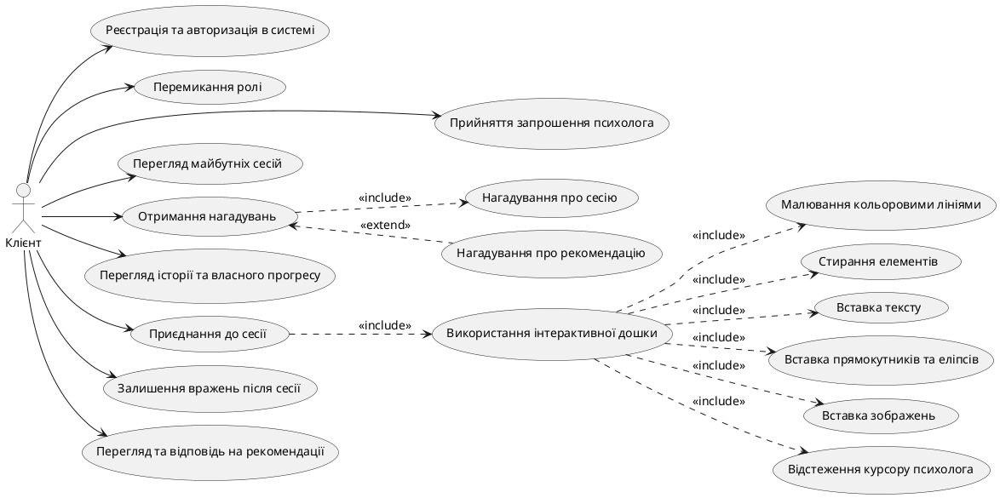
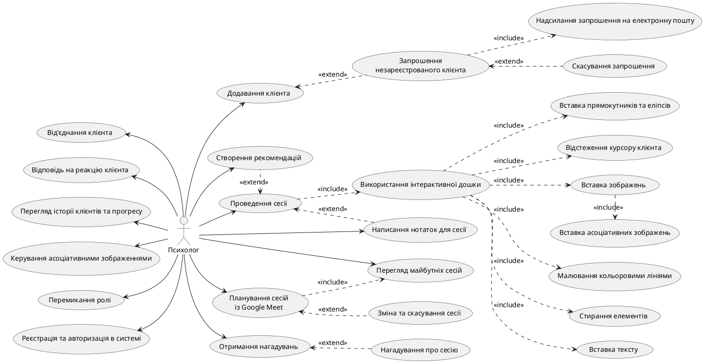

# Use case diagrams: updated for the new user stories (section 2.3)

## Client diagram

```plantuml
@startuml
left to right direction

skinparam defaultFontSize 14
skinparam nodesep 15
skinparam ranksep 45

actor "Клієнт" as c

' Основні варіанти використання
c --> (Реєстрація та авторизація в системі)
c --> (Перемикання ролі)                      
c ---> (Прийняття запрошення психолога)        
c --> (Перегляд майбутніх сесій)
c --> (Отримання нагадувань)
c --> (Перегляд історії та власного прогресу)
c --> (Приєднання до сесії)
c --> (Залишення вражень після сесії)
c --> (Перегляд та відповідь на рекомендації)

(Отримання нагадувань) ..> (Нагадування про сесію) : <<include>>
(Отримання нагадувань) <.. (Нагадування про рекомендацію) : <<extend>>

' Інтерактивна дошка та її функції
(Приєднання до сесії) ..> (Використання інтерактивної дошки) : <<include>>

(Використання інтерактивної дошки) ..> (Малювання кольоровими лініями)    : <<include>>
(Використання інтерактивної дошки) ..> (Стирання елементів)               : <<include>>
(Використання інтерактивної дошки) ..> (Вставка тексту)                   : <<include>>
(Використання інтерактивної дошки) ..> (Вставка прямокутників та еліпсів) : <<include>>
(Використання інтерактивної дошки) ..> (Вставка зображень)                : <<include>>
(Використання інтерактивної дошки) ..> (Відстеження курсору психолога)          : <<include>>

@enduml
```

## Psychologist diagram

```plantuml
@startuml
left to right direction

skinparam defaultFontSize 14
skinparam nodesep 30
skinparam ranksep 10

actor "Психолог" as p

' Основні варіанти використання
p --> (Додавання клієнта)
(Додавання клієнта) <.. (Запрошення\nнезареєстрованого клієнта) : <<extend>>
(Запрошення\nнезареєстрованого клієнта) ..> (Надсилання запрошення на електронну пошту) : <<include>>
(Запрошення\nнезареєстрованого клієнта) <.. (Скасування запрошення) : <<extend>>
p -up-> (Реєстрація та авторизація в системі)
p -up-> (Перемикання ролі)                              
p --> (Планування сесій\nіз Google Meet)
p --> (Перегляд майбутніх сесій)
p --> (Отримання нагадувань)
(Отримання нагадувань) <.. (Нагадування про сесію) : <<extend>>
(Планування сесій\nіз Google Meet) ..> (Перегляд майбутніх сесій) : <<include>>
(Планування сесій\nіз Google Meet) <.. (Зміна та скасування сесії) : <<extend>>
p -up-> (Керування асоціативними зображеннями)
p --> (Проведення сесії)
p -up-> (Перегляд історії клієнтів та прогресу)
p -up-> (Відповідь на реакцію клієнта)                  
p -up-> (Від’єднання клієнта)

(Написання нотаток для сесії) as w
(Створення рекомендацій) as c
(Використання інтерактивної дошки) as v

p --> w
p --> c

' Розширення для Приєднання до сесії
(Проведення сесії) ..> v     : <<include>>
(Проведення сесії) <.. w       : <<extend>>
(Проведення сесії) <. c       : <<extend>>

' Включення функцій інтерактивної дошки
v ..> (Малювання кольоровими лініями)           : <<include>>
v ..> (Стирання елементів)                      : <<include>>
v ..> (Вставка тексту)                          : <<include>>
v ..> (Вставка прямокутників та еліпсів)        : <<include>>
v ..> (Вставка зображень)                       : <<include>>
v ..> (Відстеження курсору клієнта)                     : <<include>>
(Вставка зображень) .> (Вставка асоціативних зображень) : <<include>>

@enduml
```
